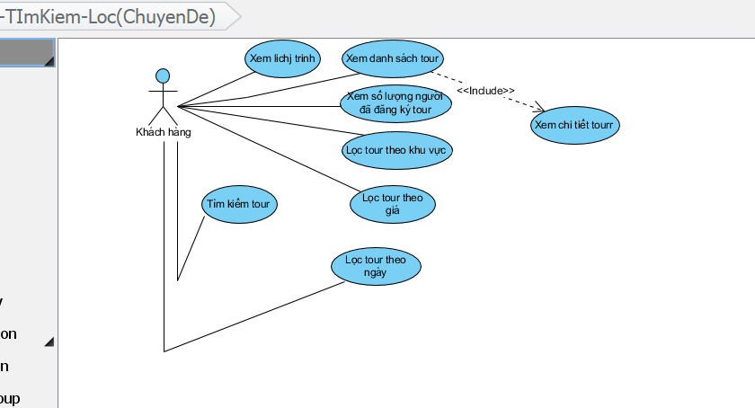
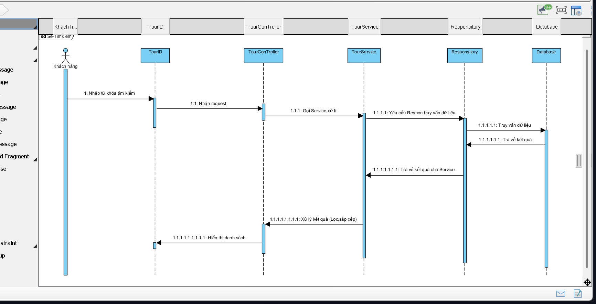
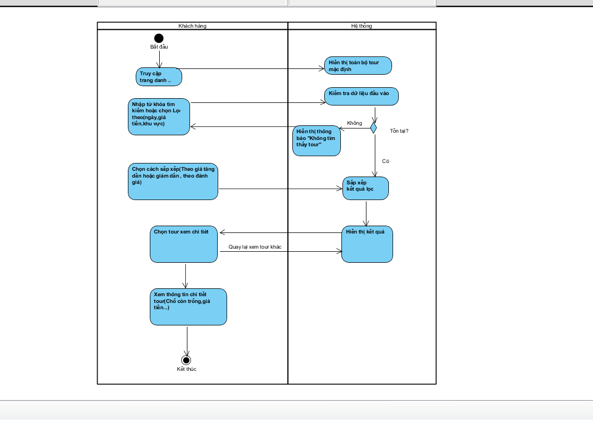
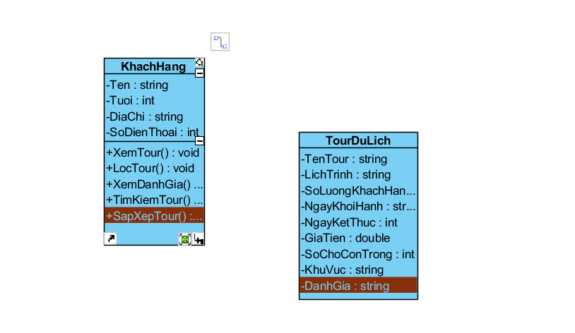

# PHÂN TÍCH & THIẾT KẾ – CHỨC NĂNG Hiển thị-Tìm Kiếm-Lọc

##UseCase Diagram-thể hiện tác nhân và usecase trong chức năng

Tác nhân chính : Khách hàng (Người dùng hệ thống)

Use case:

Xem danh sách tour (HIển thị danh sách tour có sẵn)

Tìm kiếm:Nhập từ khóa theo tên , điểm đến

Lọc Tour: lọc theo giá tiền , số ngày , phương tiện

Xem chi tiết Tour: hiển thị đầy đủ thông tin của Tour được chọn

## Sequence Diagram

Biểu đồ thể hiện việc khách hàng tìm kiếm Tour du lịch

## Activity Diagram

**Người dùng truy cập trang danh sách tour**

→ Hệ thống hiển thị toàn bộ tour mặc định, sắp xếp theo ngày khởi hành gần nhất.

1. **Người dùng nhập từ khóa tìm kiếm hoặc chọn tiêu chí lọc**Từ khóa: tên tour, điểm đến

   Lọc: giá tiền (min–max), số ngày, phương tiện di chuyển

2. **Hệ thống kiểm tra dữ liệu đầu vào**

   Nếu có kết quả → hiển thị danh sách

   Nếu không có kết quả → hiển thị thông báo “Không tìm thấy tour phù hợp”

3. **Người dùng chọn tiêu chí sắp xếp**

   Theo giá tăng/giảm

4. **Hệ thống thực hiện truy vấn dữ liệu theo filter & sort**

   → Gọi Service → Repository → Database

5. **Hệ thống hiển thị kết quả**
6.
7. **Người dùng chọn tour để xem chi tiết**

   → Gọi API `/api/tours/{id}` để lấy thông tin đầy đủ

8. **Người dùng quay lại danh sách hoặc thay đổi tiêu chí lọc**

## Class Diagram-thể hiện các lớp trong chức năng

