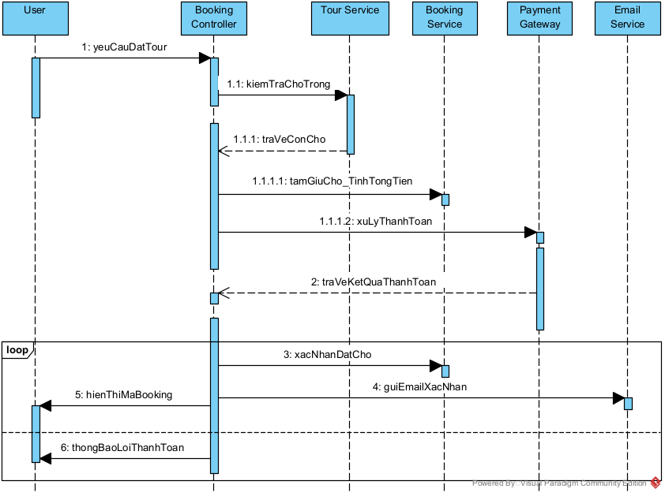
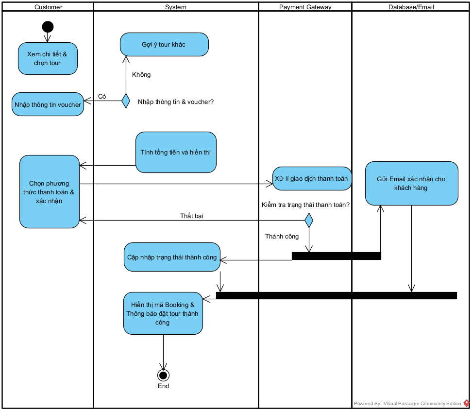
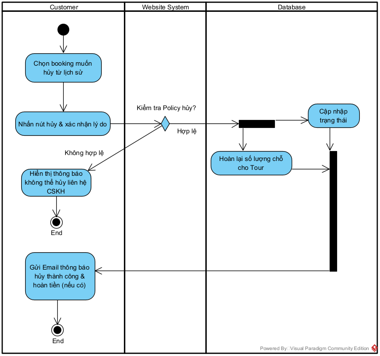
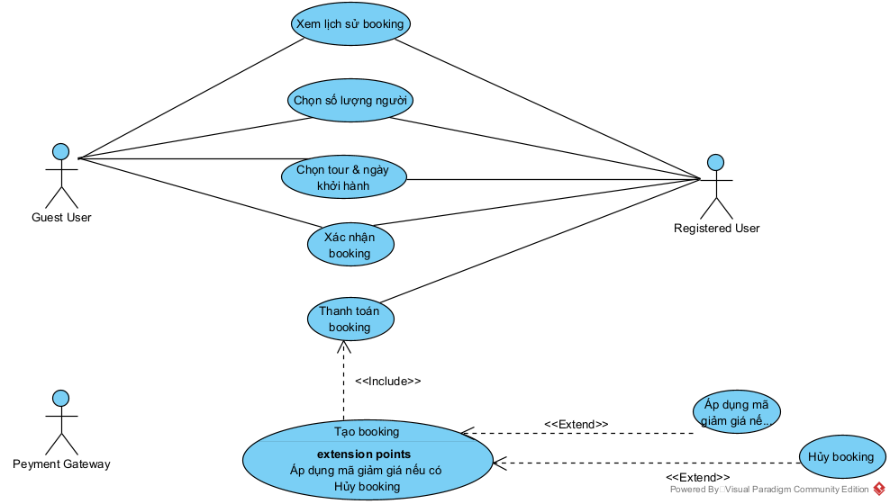
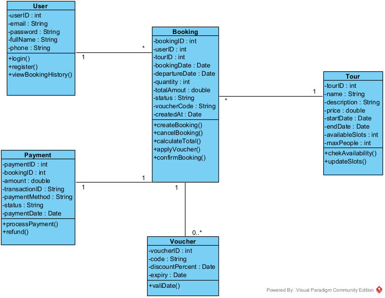

# PHÂN TÍCH & THIẾT KẾ – CHỨC NĂNG BOOKING

## Sequence Diagram

Sơ đồ mô tả trình tự tương tác giữa người dùng và hệ thống trong quá trình đặt tour.

## Activity Diagram

Sơ đồ thể hiện luồng xử lý các bước chính của hệ thống từ khi người dùng truy cập đến khi hoàn tất thao tác.

## Activity Diagram 2

Sơ đồ mô tả chi tiết luồng xử lý nghiệp vụ đặt tour của người dùng.

## Booking Tour Diagram

Sơ đồ biểu diễn quy trình đặt tour bao gồm chọn tour, nhập thông tin và xác nhận đặt tour.

## Class Diagram

Sơ đồ lớp mô tả cấu trúc dữ liệu của hệ thống và mối quan hệ giữa các lớp.