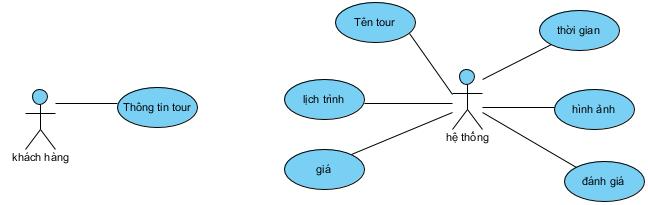
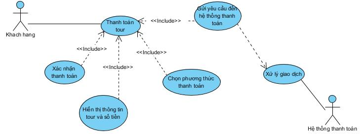
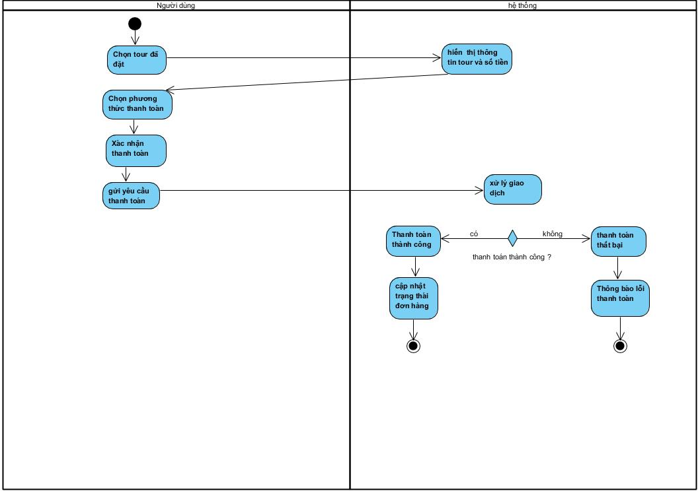
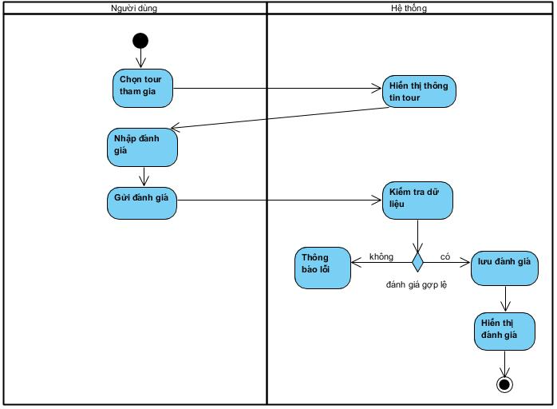

# PHÂN TÍCH VÀ THIẾT KẾ HỆ THỐNG PAYMENT & REVIEW TOUR DU LỊCH

---

## 1. Mục tiêu chức năng

### 1.1. Chức năng Payment

Chức năng Payment cho phép khách hàng thanh toán tour du lịch đã đặt thông qua hệ thống. Chức năng này đảm bảo:

* Hoàn tất giao dịch tài chính cho tour đã đặt
* Kết nối an toàn với hệ thống thanh toán bên thứ ba
* Xác nhận và ghi nhận trạng thái thanh toán

### 1.2. Chức năng Review

Chức năng Review cho phép khách hàng đánh giá tour du lịch sau khi đã tham gia. Chức năng này nhằm:

* Thu thập phản hồi từ khách hàng
* Nâng cao chất lượng dịch vụ
* Cung cấp thông tin tham khảo cho khách hàng khác

---

## 2. Phân tích nghiệp vụ

### 2.1. Đối tượng sử dụng

* **Người dùng:** Người sử dụng website để đặt tour, thanh toán và đánh giá tour
* **Hệ thống thanh toán:** Bên thứ ba xử lý giao dịch thanh toán

### 2.2. Các chức năng liên quan

**Payment**

* Hiển thị thông tin tour và số tiền
* Chọn phương thức thanh toán
* Xác nhận thanh toán
* Xử lý giao dịch

**Review**

* Xem tour đã tham gia
* Nhập đánh giá (số sao, nhận xét)
* Gửi đánh giá
* Hiển thị đánh giá

---

## 3. Biểu đồ Use Case

 **Use Case Diagram Payment**

**Use Case Diagram Review**

---

## 4. Đặc tả Use Case

### 4.1. Use Case: Thanh toán tour

**Tên Use Case:** Thanh toán tour
**Actor:** Người dùng
**Mô tả:** Cho phép khách hàng thanh toán tour du lịch đã đặt.

**Luồng chính**

1. Người dùng chọn chức năng Thanh toán
2. Hệ thống hiển thị thông tin tour và số tiền
3. Người dùng chọn phương thức thanh toán
4. Người dùng xác nhận thanh toán
5. Hệ thống gửi yêu cầu đến hệ thống thanh toán
6. Hệ thống thanh toán xử lý giao dịch
7. Hệ thống thông báo kết quả thanh toán

**Luồng ngoại lệ**

* AF1: Giao dịch thất bại
  → Hệ thống thông báo thanh toán không thành công

**Điều kiện tiên quyết**

* Người dùng đã đặt tour

**Điều kiện kết thúc**

* Thanh toán thành công hoặc thất bại

---

### 4.2. Use Case: Review tour du lịch

**Tên Use Case:** Review tour du lịch
**Actor:** Người dùng
**Mô tả:** Cho phép khách hàng đánh giá tour đã tham gia.

**Luồng chính**

1. Người dùng chọn tour đã tham gia
2. Hệ thống hiển thị thông tin tour
3. Người dùng nhập số sao và nhận xét
4. Người dùng gửi đánh giá
5. Hệ thống lưu đánh giá
6. Hệ thống hiển thị đánh giá

**Luồng ngoại lệ**

* AF1: Nội dung đánh giá không hợp lệ
  → Hệ thống yêu cầu nhập lại đánh giá

**Điều kiện tiên quyết**

* Người dùng đã hoàn thành tour

**Điều kiện kết thúc**

* Đánh giá được lưu thành công

---

## 5. Sequence Diagram

### 5.1. Sequence Diagram Payment

### 5.2. Sequence Diagram Review

---

## 6. Activity Diagram

### 6.1. Activity Diagram Payment

### 6.2. Activity Diagram Review

---

## 7. Class Diagram

Cấu trúc các lớp liên quan đến Payment và Review được thể hiện trong  **Hình Class_Payment_Review** .

---

## 8. Yêu cầu phi chức năng

* Bảo mật thông tin thanh toán và dữ liệu người dùng
* Giao tiếp an toàn với hệ thống thanh toán bên thứ ba
* Thời gian xử lý giao dịch nhanh
* Chỉ cho phép đánh giá đối với khách hàng đã tham gia tour
* Hệ thống dễ bảo trì và mở rộng
