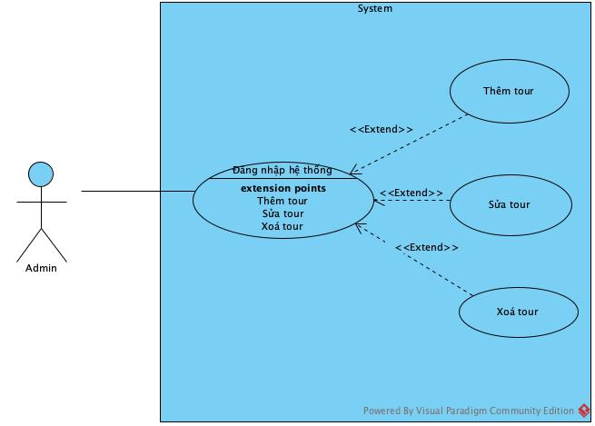
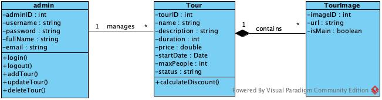
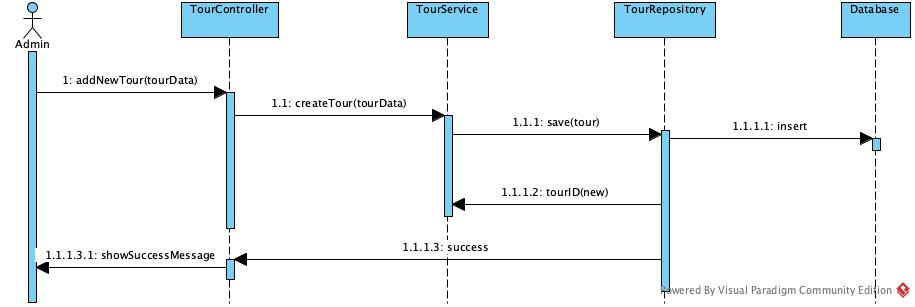

# Phân tích và Thiết kế hệ thống cho CRUD Tour

## Usecase Diagram

Sơ đồ use case dùng để xác định các chức năng chính, đối tượng tương tác và mối quan hệ

## Class Diagram

Sơ đồ lớp mô tả cấu trúc dữ liệu của hệ thống và mối quan hệ giữa các lớp.

## Sequence Diagram

Sơ đồ mô tả trình tự tương tác giữa admin và hệ thống .

